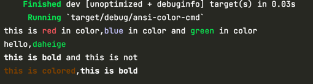

# ansi_term 终端文本颜色设置
- 打印彩色文本到终端实用
```rust
println!(
        "this is {} in color,{} in color and {} in color",
        Colour::Red.paint("red"),
        Colour::Blue.paint("blue"),
        Colour::Green.paint("green"),
    );
```
- 对于比简单的前景色变化更复杂的事情，代码需要构造 Style 结构体
```rust
 println!(
        "{} and this is not",
        Style::new().bold().paint("this is bold")
    );
```

运行效果如下：

