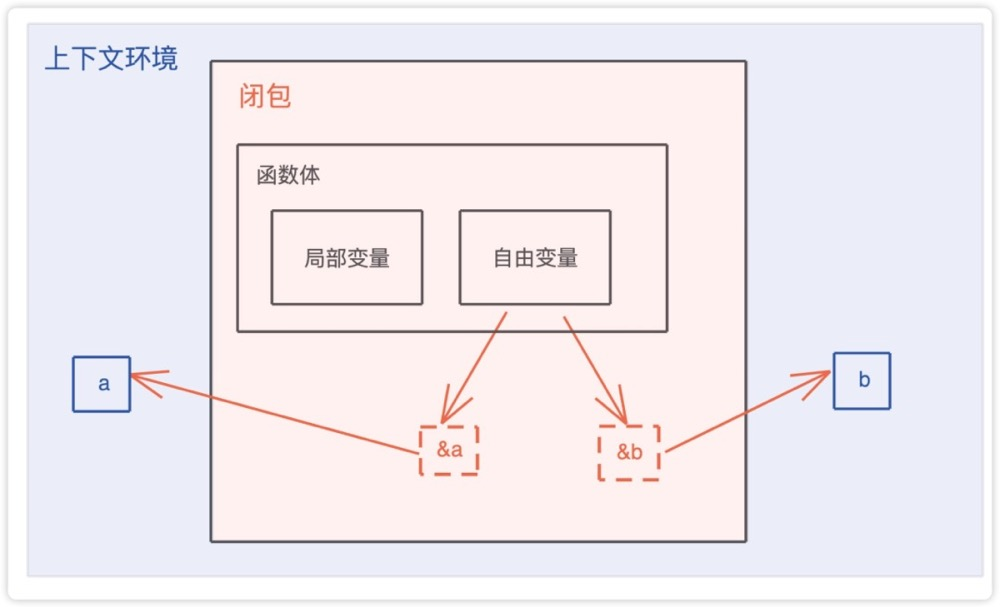
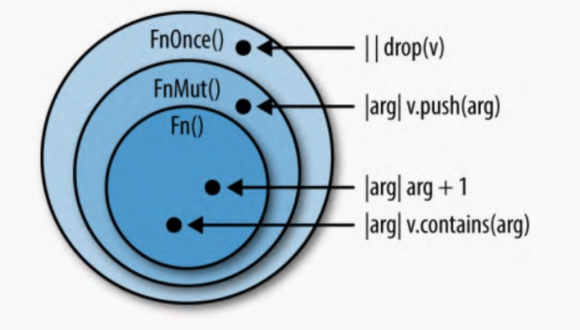

# clourse闭包的本质
- 闭包是一种匿名类型，一旦声明，就会产生一个新的类型，但这个类型无法被其它地方使用。这个类型就像一个结构体，会包含所有捕获的变量。
- 闭包是将函数，或者说代码和其环境一起存储的一种数据结构。(闭包也是一种数据结构吗？) 闭包引用的上下文中的自由变量，会被捕获到闭包的结构中，成为闭包类型的一部分。

# rust语言中的闭包
- 闭包会根据内部的使用情况，捕获环境中的自由变量
- 默认情况下，不带move时，闭包捕获闭包外部变量的不可变引用，也就是借用机制
- 如果要获取变量的所有权，就需要用move 关键字，转移变量的所有权ownership到闭包中
- 对于非基本类型的情况下，move将所有权移动到闭包中，后续该变量就无法使用了



```rust
use std::thread;

fn main() {
    let a = "hello";
    let b = "wolrd";
    // 默认情况，闭包是借用a,b也就是说不可变引用模式&a，而不是move变量的所有权到闭包中
    let c = |msg| {
        println!("a = {},b = {},msg:{}", a, b, msg);
    };

    c("rust");

    // 通过move关键字将当前作用域的变量所有权转移到闭包中
    let s = String::from("hello world,rust");
    let handler = thread::spawn(move || {
        println!("s moved to clourse,s = {:?}", s);
    });

    handler.join().unwrap(); // 等待线程执行完毕

    // 对于非基本类型的情况下，move将所有权移动到闭包中，后续该变量就无法使用了
    let m = String::from("hello world,rust");
    let n = move || {
        println!("m = {}", m);
    };
    n();
    // println!("m:{}", m); // - variable moved due to use in closure

    // 可变变量的闭包使用情况,下面的使用是错误的用法
    // let mut s2 = String::from("hello");
    // let c3 = move || {
    //     c2 = "abc".to_string(); // cannot find value `c2` in this scope
    // };
}
```

# FnOnce/FnMut/Fn trait
rust语言中有三种类型的闭包：FnOnce/FnMut/Fn
对于三种不同的闭包类型:
- FnOnce 只允许调用一次，它会获取参数self所有权
- FnMut 允许在执行时候修改闭包内部数据，它会获取参数&mut self可变引用,可执行多次，本质上是能够读写的闭包类型
- Fn 不允许修改闭包的内部数据，因为参数类型是&self借用，但它可以执行多次

## FnOnce trait特征
对于FnOnce来说，它的基本定义如下：
```rust
pub trait FnOnce<Args: Tuple> {
    /// The returned type after the call operator is used.
    #[lang = "fn_once_output"]
    #[stable(feature = "fn_once_output", since = "1.12.0")]
    type Output;

    /// Performs the call operation.
    #[unstable(feature = "fn_traits", issue = "29625")]
    extern "rust-call" fn call_once(self, args: Args) -> Self::Output;
}
```

- 其中Output是FnOnce的关联类型，也就是闭包的返回值。
- call_once的第一个参数是self，表示它会转移self的所有权到函数内部中。
- Args 是泛型参数
- FnOnce被称为once：只能调用一次。如果再次调用的话，编译器就会报变量已经被move了所有权错误。
```rust
fn greet() {
    let name = "hello".to_string();
    // 下面的闭包接收参数后，返回了greeting,name
    // c通过move关键字将name的所有权已经移动到了闭包内部，所有其他地方就不能再次调用闭包了
    // c在这里属于FnOnce的闭包，只能调用一次
    let c = move |greeting: String| (greeting, name);
    let res = c("abc".to_string()); //  - name value moved here
    println!("res:{:?}", res);

    // 下面再次使用c就无法使用，编译时不通过
    // let res = c("abc".to_string()); //   ^ value used here after move
    // println!("res:{:?}", res);

}
```
下面的闭包c就不是FnOnce
```rust
let user = "abc";
let c = move |greeting: String| {
    println!("greeting: {} name:{}", greeting, user);
};

c("go".to_string());
c("java".to_string());
```
执行结果是：
res:("abc", "hello")
greeting: go name:abc
greeting: java name:abc

## FnMut trait特征
定义如下：
```rust
pub trait FnMut<Args: Tuple>: FnOnce<Args> {
    /// Performs the call operation.
    #[unstable(feature = "fn_traits", issue = "29625")]
    extern "rust-call" fn call_mut(&mut self, args: Args) -> Self::Output;
}
```
- FnOnce 是FnMut的super trait，也就是说FnMut是继承了FnOnce trait
- FnMut实际上来说，是可变闭包，也就是说可以读写操作的闭包
- Output是FnMut返回类型，是一个关联类型
- call_mut参数是&mut self，它是可变引用，不转移所有权self,可以多次调用
- 想要在FnMut闭包内修改捕获的变量，外部变量必须要使用mut修饰变量是可变变量
```rust
// 声明的时候是需要采用mut定义变量为可变类型
let mut name = String::from("hello");
let mut name1 = String::from("wolrd");
// 下面的闭包捕获 &mut name,&mut name1
let mut c1 = move || {
    name.push_str(",rust");
    println!("name:{}", name);
};
let mut c2 = move || {
    name1.push_str(",rust");
    println!("name1:{}", name1);
};
// FnMut类型的闭包可以多次调用
// 下面的call_mut 多次调用，需要使用&mut self可变引用
call_mut(&mut c1);
call_mut(&mut c1);
call_mut(&mut c1);

call_mut(&mut c2);
call_mut(&mut c2);

// 下面是FnOnce调用
call_once(c1);
call_once(c2);

// 参数c是一个&mut impl FnMut trait
// 表明参数是一个可变类型的闭包
fn call_mut(c: &mut impl FnMut()) {
    c();
}

// c是一个实现了FnOnce trait特征的闭包类型
fn call_once(c: impl FnOnce()) {
    c();
}
```
- 在闭包c1传递给call_mut函数的时候，函数里捕获了&mut name,因为没有move所有权，所以是可变借用。
- 在闭包c2传递给call_once函数的时候，函数里捕获了mut name1,move了name1的所有权。

运行结果：
name:hello,rust
name:hello,rust,rust
name:hello,rust,rust,rust
name1:wolrd,rust
name1:wolrd,rust,rust
name:hello,rust,rust,rust,rust
name1:wolrd,rust,rust,rust

## Fn trait特征
rust语言定义如下：
```rust
pub trait Fn<Args: Tuple>: FnMut<Args> {
    /// Performs the call operation.
    #[unstable(feature = "fn_traits", issue = "29625")]
    extern "rust-call" fn call(&self, args: Args) -> Self::Output;
}
```
- Fn 继承了FnMut或者说FnMut是Fn的super trait
- 用FnOnce或FnMut的时候，都可以用Fn闭包来满足
- call参数是&self，它是不可变引用，不转移所有权self
- fn和Fn trait不是一回事，fn是一个函数指针，不是闭包类型
```rust
// c是一个FnMut特征
fn call_twice<F>(mut c: F)
where
    F: FnMut(),
{
    c();
    c();
}

let mut n = "abc".to_string();
let c3 = || {
    n.push_str(",rust");
    println!("name1:{}", n);
};
call_twice(c3);
println!("n:{}", n);
```

# 闭包使用场景：
- thread::spawn 线程中使用闭包处理相关逻辑
- iterator trait里面，大部分函数都接收一个闭包类型，比如说map
- 为闭包实现了某个trait，让它可以有其他的行为

# rust闭包小结
- Fn 是没有调用次数限制的闭包和函数，是所有 fn 函数中最高的一种
- FnMut 是如果闭包本身声明为 mut 也可以多次调用的闭包，它是可以读写的闭包
- FnOnce 是如果调用者拥有闭包则只能调用一次的闭包
- 每个 Fn 都满足 FnMut 的要求，每个 FnMut 都满足 FnOnce 的要求
- Fn() 是 FnMut() 的子特型，而 FnMut() 又是 FnOnce() 的子特型。于是 Fn 就成了最专一且最强大的类别。FnMut 和 FnOnce则是包含使用限制的更广泛的类别


# 闭包的性能
- 闭包里捕获的外部变量，都存放在栈上，没有堆内存的分配
- 闭包在创建的时候，会隐式创建自己的类型，每个闭包都是一个新的类型（trait特征）
- 不需要额外的函数指针fn来运行闭包，效率和函数几乎一样
- Rust 闭包的设计保证它非常快，比函数指针还要快，快到完全可以用在强度和性能要求极高的环境下。如果你熟悉 C++ 的 lambda 表达式，就会发现 Rust 闭包跟它一样快且简洁，但更安全
- 跟其他语言不一样的地方，在大多数语言中，闭包是分配在堆上，动态分派，然后由垃圾回收程序负责回收的。因此创建、调用和回收它们都会多花那么一点点 CPU时间。更麻烦的是，编译器很难对闭包应用行内化优化策略以减少函数调用并进而应用其他优化。总之，这些语言中的闭包可以慢到需要你考虑把它们从紧凑的内部循环（tight inner loop）中移出来
- rust  闭包完全没有这些性能上的缺点。Rust 就没有垃圾回收。与Rust 中的其他特性一样，闭包不会被分配到堆上，除非你把它们装到Box、Vec 或其他容器里。而且因为每个闭包都有一个不同的类型，所以 Rust 编译器只要知道了你所调用闭包的类型，就可以将该闭包的代码行内化
