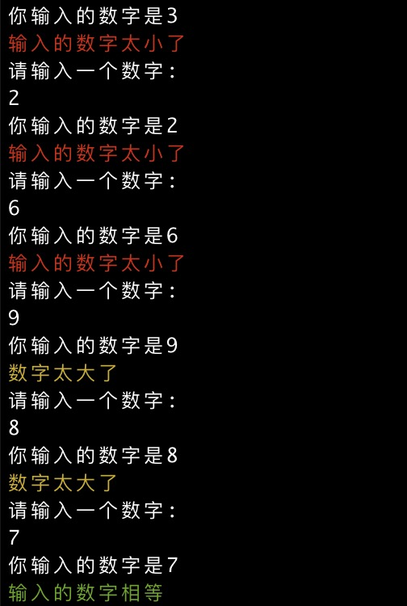

# guess number
```rust
use colored::*; // 用于颜色输出
use rand::Rng;
use std::cmp::Ordering;
use std::io::stdin;

fn main() {
    let rnd: i32 = rand::thread_rng().gen_range(1..10);
    loop {
        println!("请输入一个数字:");
        let mut guess_number = String::new();
        stdin()
            .read_line(&mut guess_number)
            .expect("你输入的字符串非法");
        let guess: i32 = match guess_number.trim().parse() {
            Ok(num) => num,
            Err(err) => {
                println!("err:{}", err);
                continue;
            }
        };

        println!("你输入的数字是{}", guess);

        match guess.cmp(&rnd) {
            Ordering::Less => println!("{}", "输入的数字太小了".red()),
            Ordering::Equal => {
                println!("{}", "输入的数字相等".green());
                break;
            }
            Ordering::Greater => println!("{}", "数字太大了".yellow()),
        }
    }
}

```

# 运行效果
cargo run

